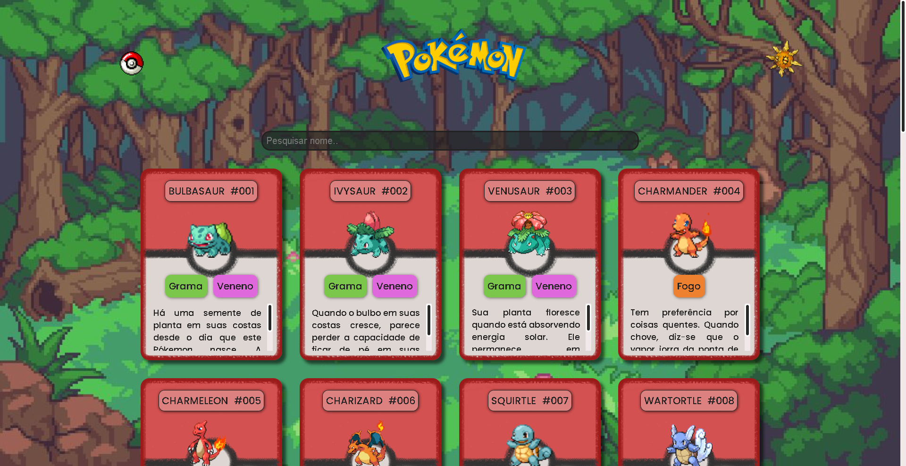

<h1 align="center"> Projeto Listagem de Pokémon </h1> 

### 🖥️ Projeto
Esse é um projeto de listagem de Pokémon em cards utilizando HTML, CSS e JavaScript. O projeto foi desenvolvido durante o evento do Dev em Dobro.

### ⚙ Funcionalidades
- Tema escuro: O usuário pode alternar entre o tema claro e escuro;
- Possui barra de perquisa e botão de voltar ao topo;
- Infos gerais: Cada card representa um pokémon, apresentando número de ordem, tipagem, descrição e versão shiny;
- Interatividade: A imagem do pokémon no card age como um botão, que quando acionado, dispara um som e mostra a versão shiny do pokémon.

### 🚀 Tecnologias
- HTML
- CSS
- JavaScript
- Git e Github
